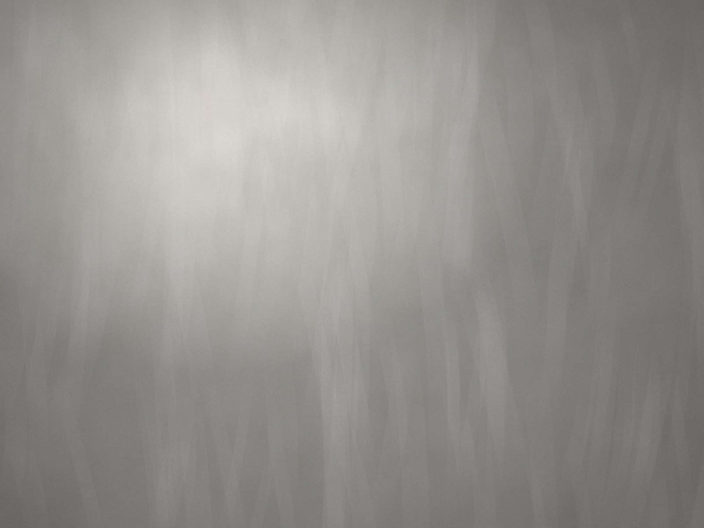

# Eigene Fotos einsetzen

## Warum die Bilder ersetzt werden müssen

Die sechs Dateien in `assets/projekte/` sind erzeugte Materialaufnahmen —
Oberflächen, die aussehen wie Anstrich und Putz, aber keine Fotos echter
Aufträge sind. Sie halten das Layout, bis eigene Bilder da sind.

**Keine Bilder aus der Google-Bildersuche verwenden.** Fast alles dort ist
urheberrechtlich geschützt. Auf einer Firmenwebsite ist das kein Kavaliersdelikt:
Rechteinhaber und darauf spezialisierte Kanzleien suchen gezielt nach solchen
Verwendungen, und eine Forderung liegt schnell im vierstelligen Bereich. Dass ein
Bild frei auffindbar ist, heisst nicht, dass es frei verwendbar ist.

Drei saubere Wege:

1. **Eigene Fotos.** Für einen Handwerksbetrieb mit Abstand am besten — echte
   Arbeit verkauft besser als jedes Stockfoto.
2. **Lizenzfreie Bilder** von [unsplash.com](https://unsplash.com),
   [pexels.com](https://pexels.com) oder [pixabay.com](https://pixabay.com).
   Kostenlos, auch geschäftlich nutzbar. Suchbegriffe: `painter wall`,
   `plastering`, `house painting`, `renovation`.
3. **Fotograf beauftragen.** Ein halber Tag auf einer laufenden Baustelle
   liefert genug Material für Jahre.

---

## So werden die Bilder ersetzt

Die Dateinamen sind im HTML fest verdrahtet. Wer die gleichen Namen verwendet,
muss am Code nichts ändern:

| Datei | Zeigt | Steht wo |
| --- | --- | --- |
| `01-innenanstrich.jpg` | Innenanstrich, fertige Wand | Hintergrund oben, Karte „Malerarbeiten", Galerie |
| `02-fassade.jpg` | Fassade aussen | Galerie |
| `03-gipserarbeiten.jpg` | Verputzte Wand | Karte „Gipserarbeiten", Galerie |
| `04-feinputz.jpg` | Feine, glatte Oberfläche | Galerie, Bild bei „Über uns" |
| `05-farbberatung.jpg` | Farbfläche oder Farbmuster | Galerie |
| `06-reinigung.jpg` | Gereinigte Fläche | Karte „Reinigung", Galerie |

Vorgehen: eigenes Foto auf den passenden Namen umbenennen, die Datei in
`assets/projekte/` überschreiben, Seite neu laden. Fertig.

`01-innenanstrich.jpg` und `04-feinputz.jpg` werden gross dargestellt — dafür
die besten Aufnahmen nehmen.

---

## Bildanforderungen

- **Format:** JPG
- **Grösse:** mindestens 1600 × 1200 Pixel, quer
- **Dateigrösse:** höchstens etwa 300 KB pro Bild

Zu grosse Dateien machen die Seite auf dem Handy langsam. Verkleinern lassen
sie sich kostenlos auf [squoosh.app](https://squoosh.app) oder
[tinyjpg.com](https://tinyjpg.com) — dort ist ein Bild in wenigen Sekunden von
4 MB auf 200 KB gebracht, ohne sichtbaren Qualitätsverlust.

---

## Fotografieren auf der Baustelle

- **Tageslicht nutzen.** Kein Blitz. Am besten am Vormittag, wenn Licht durchs
  Fenster kommt.
- **Vorher und nachher.** Der Vergleich wirkt stärker als jedes fertige Bild
  allein. Für das Nachher-Foto von derselben Stelle aus fotografieren.
- **Aufräumen vor dem Auslösen.** Farbeimer, Kabel und Abdeckfolie aus dem Bild.
- **Quer halten.** Hochkant-Fotos werden im Layout beschnitten.
- **Gerade stehen.** Kanten parallel zum Bildrand, sonst kippt die Wand.
- **Auch Details.** Eine saubere Kante oder ein Übergang Wand-Decke zeigt
  Handwerk oft besser als ein ganzer Raum.

Wichtig: Wo Personen erkennbar sind oder fremde Wohnungen zu sehen sind, vorher
die Erlaubnis der Kundschaft einholen.

---

## Beschriftungen anpassen

Sobald echte Aufträge abgebildet sind, kann die Galerie auch echte Angaben
tragen. In `index.html` im Abschnitt `id="referenzen"`:

```html
<figcaption>Innenanstrich<small>Matte Dispersion, Wand und Decke</small></figcaption>
```

wird dann zum Beispiel zu:

```html
<figcaption>Innenanstrich<small>3-Zimmer-Wohnung, Biel</small></figcaption>
```

Dann passen auch die Überschrift „Was wir ausführen." und der Menüpunkt
„Oberflächen" nicht mehr — beides darf zu „Referenzen" werden. Solange dort
Platzhalter stehen, sollte das Wort „Referenzen" nicht verwendet werden: es
verspricht abgeschlossene Kundenaufträge.

Ebenfalls anpassen: der `alt`-Text jedes Bildes. Er beschreibt das Bild für
Suchmaschinen und für Menschen, die die Seite vorlesen lassen.

```html

```

---

## Nach dem Austausch veröffentlichen

Bei Netlify-Anbindung an GitHub:

```bash
git add assets/projekte/
git commit -m "Eigene Projektfotos eingesetzt"
git push
```

Netlify baut die Seite von selbst neu. Ohne GitHub: den Ordner erneut auf
[app.netlify.com/drop](https://app.netlify.com/drop) ziehen.
